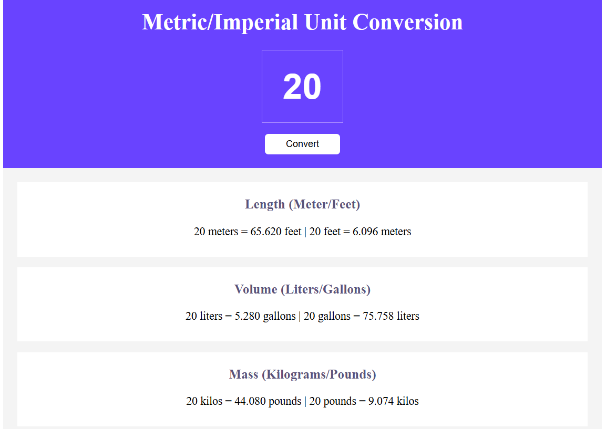

Unit Converter 🧮🌍

A simple unit conversion tool built with HTML, CSS, and JavaScript. It allows you to convert between Metric and Imperial units for Length (Meter/Feet), Volume (Liters/Gallons), and Mass (Kilograms/Pounds).

Features ✨:

-Convert length between meters and feet. 📏

-Convert volume between liters and gallons. 💧

-Convert mass between kilograms and pounds. ⚖️

-Validates input and alerts the user if it's invalid. 🚨

How to Use 📝:

-Enter a value in the input field. ⬇️

-Click "Convert" to see the conversions. 🔄

-Results will display for length, volume, and mass. 📊

Technologies Used 🛠️:

-HTML: Structure 🏗️

-CSS: Styling 🎨

-JavaScript: Logic and interaction 💻

## 📸 Preview

 
